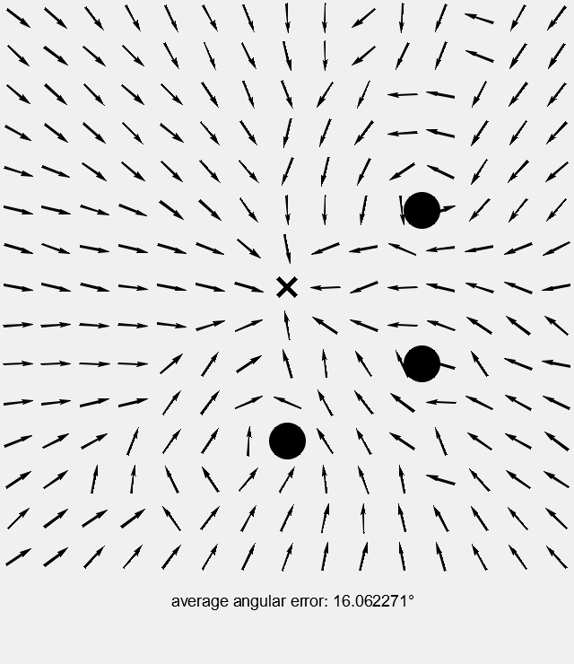
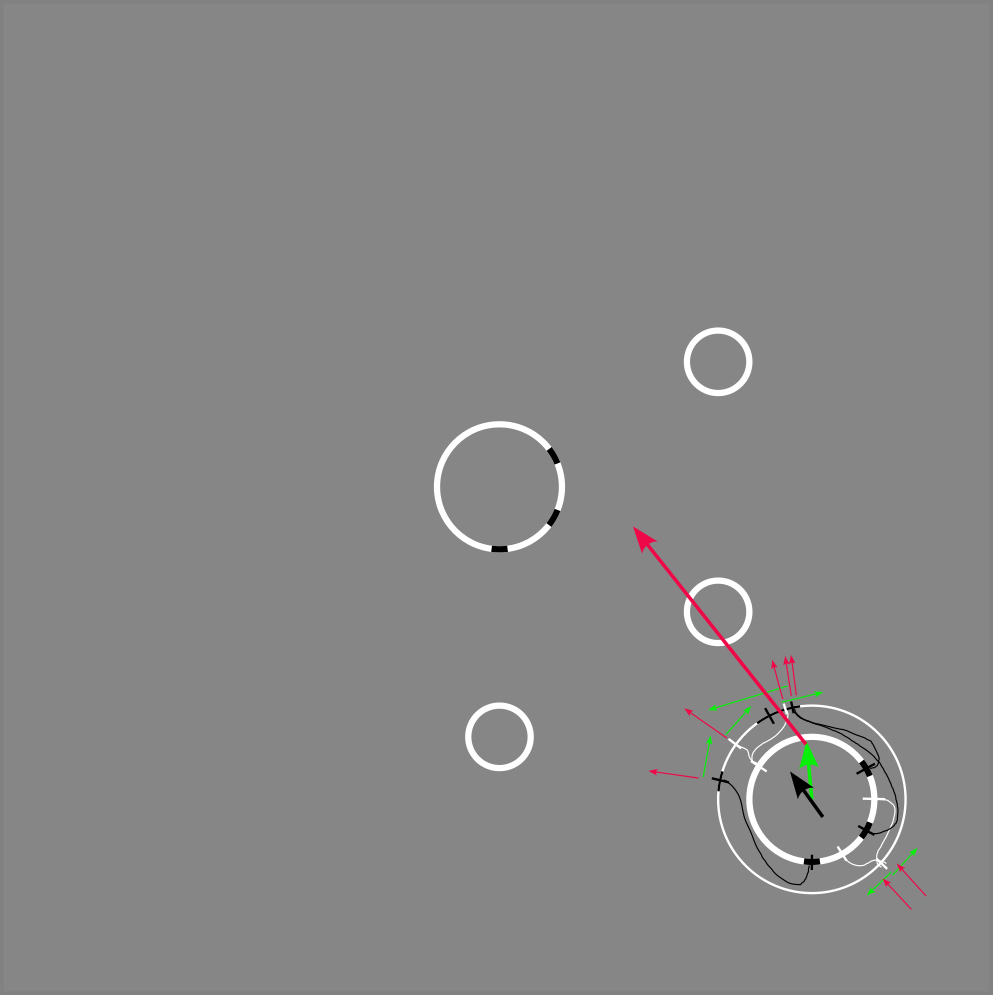
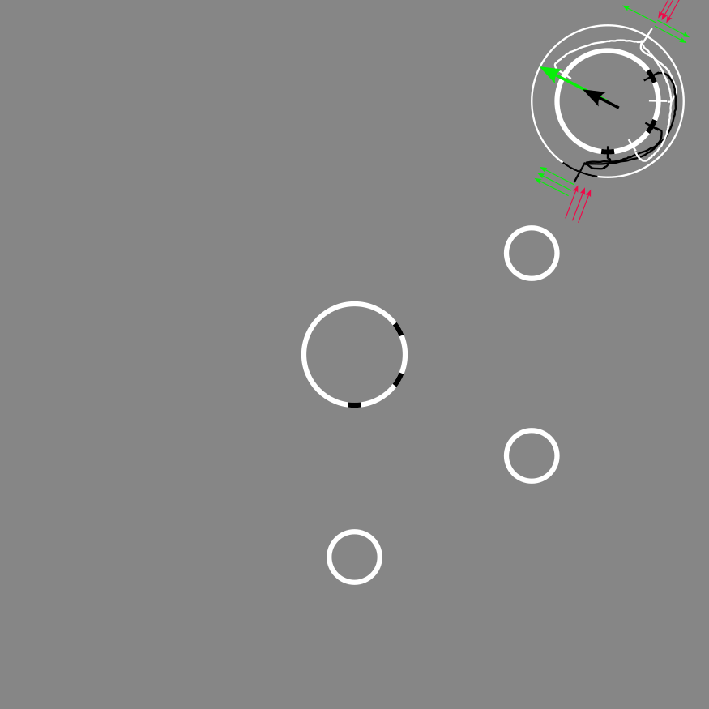
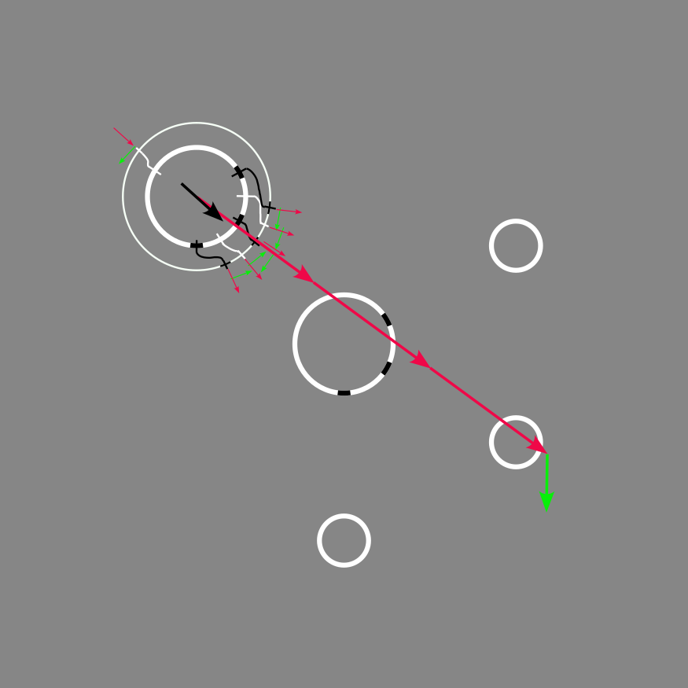

# Homing

this is a project that implements the homing algorithm described in the paper "__How honey bees use landmarks to guide their return to a food source__" by B. A. Cartwright & T. S. Collett.

---

## Running the code

### The rust toolchain

First make sure that the rust toolchain is installed on your machine. To check simply run the following command:

```sh
# rustup --version
```

If the rust toolchain is not installed, follow the installation instructions from the official site [here](https://www.rust-lang.org/tools/install).

### Compiling and running the code

Run the following command inside the root directory of this project:

```sh
# cargo run
```

The code will generate the image with the generated homing vectors. This image will be located in the root directory of this project.  
__Note:__
When running the code for the first time, cargo will install and compile the dependencies before running the code. Subsequent compilations will not take as long.  

---

## The Result

The final result will look like this:


the 3 hand made calculations are:




---

## Dependencies that were used

The only dependency that was added is [plotters](https://crates.io/crates/plotters). It is used for generating the final image.
